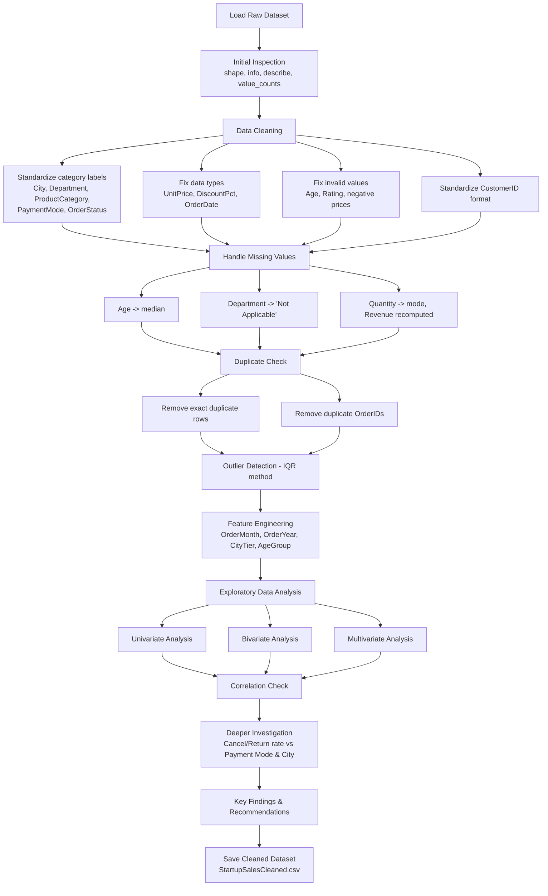

# Startup Sales — EDA & Data Cleaning

Exploratory Data Analysis on a messy, raw startup sales dataset — covering data cleaning, missing value handling, duplicate removal, outlier detection, feature engineering, and univariate/bivariate/multivariate analysis to uncover revenue and order-behavior patterns.

## Tools Used

- **Python**
- **Pandas** — data cleaning, transformation, aggregation
- **NumPy** — numeric operations, missing value handling
- **Matplotlib** — chart rendering
- **Seaborn** — statistical visualizations (bar, box, histogram, heatmap)
- **Jupyter Notebook** — analysis environment

## Project Workflow

## Insights

- **Top-performing product categories:** Electronics and Home & Kitchen are tied for the highest total revenue (~₹3.0 crore each), well above every other category (~₹1.2 to ₹1.6 crore).
- **Top-performing city:** Bangalore generated the highest total revenue (~₹2.7 crore), followed by Kolkata (~₹2.25 crore).
- **Order outcomes:** Completed orders make up 28.58% of all orders, statistically tied with Cancelled at 28.57%. Cancelled + Returned together make up 43.09% of all orders.
- **Price vs. cancellations:** Higher priced orders are not more likely to be cancelled or returned — the price distribution looks similar across all order statuses.
- **Age group insight:** The 36 to 45 age group contributes the most revenue overall, and prefers Home & Kitchen as a category.
- **Rating insight:** Average rating is essentially flat across all order statuses (~3.85 to 3.9) and between returning vs. new customers (~3.88 vs ~3.89). Rating does not appear tied to order outcome or customer loyalty.
- **Correlation check:** `Revenue` correlates strongly with `UnitPrice` (0.88), which is expected since Revenue is calculated from it. `Quantity` has only a weak link to Revenue (0.09). `Rating`, `Age`, and `DiscountPct` show essentially no correlation with anything else.
- **Cancel/return rate investigation:** Neither payment mode nor city explains the ~43% cancel/return rate — the proportion of Cancelled/Returned orders is nearly identical across every payment mode and every city. This points to a systemic issue or a factor not captured in this dataset, rather than a specific operational segment.
- **Outliers:** 1,164 orders were flagged as unusually high priced using the IQR method (not removed) — worth a follow-up check on whether these are bulk/B2B orders or data errors.

**Recommendation:** Prioritize marketing and inventory focus on Electronics, Home & Kitchen, and Bangalore/Kolkata, since they drive the largest share of revenue. The bigger open issue is the ~43% cancel/return rate — since it isn't explained by price, rating, payment mode, or city, the next investigation should look at data this dataset doesn't include (delivery timestamps, stock availability, customer service logs) to find the actual driver.

## Limitations

- This is a synthetic/practice dataset, so patterns here (e.g. flat ratings, uniform cancellation rate) may not reflect real seasonal trends, real customer behavior, or real market dynamics.
- `Email` (412 missing) and `Rating` (2,379 missing) were left unimputed rather than filled, since guessing these values could bias any analysis built on them.
- Outliers in `UnitPrice`/`Revenue` were flagged but not removed, so summary statistics like the overall mean are still somewhat pulled upward by a small number of extreme orders.
- We checked price, rating, payment mode, and city as possible drivers of the high cancel/return rate — none of them explain it. The root cause likely lies in data this dataset doesn't include, so this remains an open question rather than a solved one.
